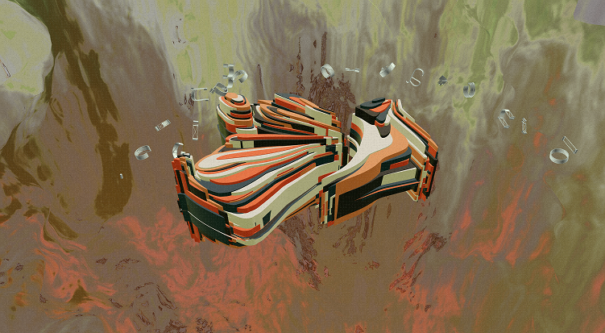
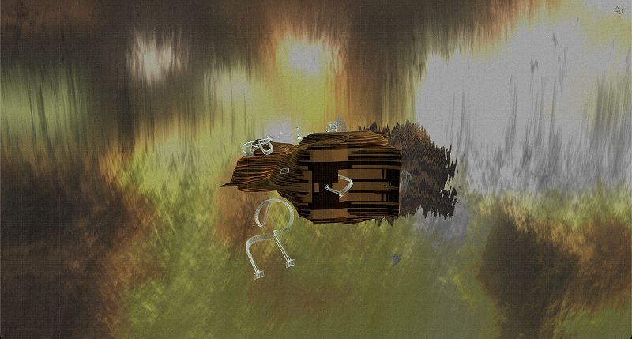
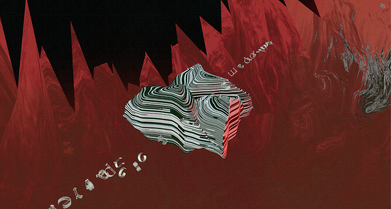

# Topografías de la intemperie

Software de composición para la obra **Topografías de la intemperie**, instalación interactiva desarrollada en el marco de la Maestría en Artes Electrónicas de la Universidad Nacional Tres de Febrero (UNTREF).

> Topografías de la intemperie es una instalación interactiva que construye territorios imaginarios a partir de memorias espaciales deformadas. Paisajes virtuales navegables donde geografía, sonido, lenguaje e interacción convergen para producir una experiencia perceptiva inestable.

Este repositorio concentra las herramientas para armar esas escenas: extrusión de topografías en Blender, el visor Three.js de composición/navegación, mapas de entorno y escenas exportables a JSON.


<table>
  <tr>
    <td width="50%"></td>
    <td width="50%"></td>
  </tr>
  <tr>
    <td width="50%"></td>
    <td width="50%"></td>
  </tr>
</table>

### Visor 3D

Visor Three.js que **arma y navega escenas** a partir de modelos GLB, mapas de entorno, agua, texto, audio espacial y efectos (grain, dither). El panel lateral (Tweakpane) organiza la composición en pestañas **Scene / Animation / Text / Audio**, con estados exportables a JSON.

```bash
npm install
npm run start
```

Guía del panel, pestañas y navegación: **[docs/visor.md](docs/visor.md)**. Arquitectura: ** [diagrama](docs/arquitectura-dark.svg).

### Audio

Mezcla Howler de dos buses: **entorno** (HTML5, loop, no espacial) y **objeto** (Web Audio + HRTF anclado a la raíz del GLB; la cámara es el oyente). Parámetros en la pestaña Audio / JSON de escena (`envVolume`, `objectVolume`, `sensitivity`).

Diagrama: [docs/audio-arquitectura-dark.svg](docs/audio-arquitectura-dark.svg)

### Script para Blender (`extrude_curves.py`)

Extruye curvas SVG importadas en Blender con un perfil de altura dinámico (coseno).

```python
# Ejecutar en Blender:
exec(open("/path/to/extrude_curves.py").read())
```

**Parámetros:**
- `MAX_HEIGHT` — altura máxima de extrusión
- `TOP_CURVE` / `BOTTOM_CURVE` — rango de curvas a procesar
- `COMPENSATE_CENTER` — centra verticalmente cada curva


#### Environment maps (EXR)

Los entornos deformados experimentales se construyen a partir de fotos en `env/exr/jpg/` (`.jpg`, `.jpeg`, `.heic`). La conversión usa [OpenImageIO](https://openimageio.readthedocs.io/) (`oiiotool`).

**Instalar OpenImageIO (macOS):**

```bash
brew install openimageio
```

**Convertir fuentes a EXR** (genera `env/exr/<name>_env.exr` y regenera la lista en `src/exrEnvironments.generated.js`):

```bash
npm run convert:env
```

Cada imagen se procesa con:

```bash
oiiotool <source> \
  --tocolorspace linear \
  --mulc 6,6,6 \
  --resize 4096x2048 \
  -o env/exr/<name>_env.exr
```

#### Sensores

El visor se conecta a un sistema externo de sensores a través de **[ardeidae](https://github.com/rafaelbecks/ardeidae)** . Ese proceso agrega IMU (Inertial Measurement Unit), lidar y NFC y reenvía lecturas por **WebSocket** (`ws://127.0.0.1:8080`). El visor abre esa conexión al arrancar.

| Sensor | Rol en la obra |
| --- | --- |
| **Acelerómetro / IMU** (WITMotion vía BLE) | Orienta el modelo o la cámara: rotar el “mineral” o el punto de vista según la pose del dispositivo. |
| **TF-Luna (lidar)** | Distancia del visitante → zoom / acercamiento de la órbita (proximidad como profundidad). |
| **NFC (PN532)** | Tarjetas de memoria: al acercar una tarjeta se carga una escena (equivalente a las teclas `1`–`N`). Firmware Arduino: [`nfc_reader.ino`](./nfc_reader.ino/nfc_reader.ino.ino). |

Configuración de puertos seriales, mapeo UID → índice de tarjeta y transporte WS están en ardeidae (`src/config.js`). Para instalación, calibración y detalles de OSC/WS, ver el [README de ardeidae](https://github.com/rafaelbecks/ardeidae).

## Autor

Rafael Becerra

## Licencia

MIT
